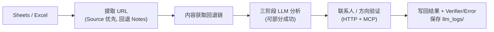
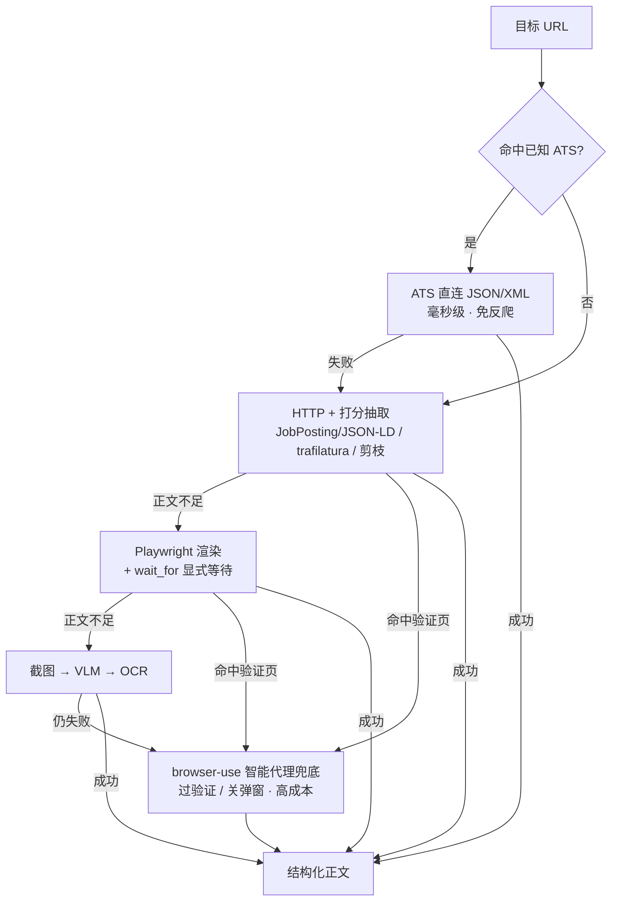

# 基于LLM的学术机会信息智能分析系统

这是一个批量化的智能文本分析系统，能够从网页、PDF、截图、本地 Excel 以及 Google Sheets 中提取学术机会信息。系统自动获取来源内容，通过大语言模型(LLM)进行三阶段分析，对关键字段进行校验，并将结构化结果自动写回数据表。

## 🚀 快速开始

### 环境要求

- **Python**: **3.11+**（`browser-use` 智能代理兜底的最低要求）。程序启动时会强制校验版本，低于 3.11 会直接终止并提示切换解释器。**注意 IDE / 终端里实际使用的解释器**：用旧环境（如 conda `py310`）运行时 browser-use 会静默降级为不可用（v3.2 起直接拒绝启动）
- **New API 网关**: `https://newapi.gisphere.info/v1`
- **Python 依赖**: 见 [`requirements.txt`](requirements.txt)（含 `trafilatura`、`lxml_html_clean`、`browser-use` 等；主流水线的 LLM 调用走 `requests`，`openai` SDK 仅作为 browser-use 的依赖间接安装）
- **系统工具**（不通过 pip 安装，需单独配置）:
  - **Node.js + npx**: 联系人/方向验证的 Playwright MCP 依赖 `npx @playwright/mcp`（见 `analysis_stage.py`）
  - **Tesseract OCR**: `pytesseract` 回退路径；需安装 **`eng` + `chi_sim`** 语言包（与 `OCR_LANGUAGE = 'eng+chi_sim'` 一致）
  - **Playwright Chromium**: 动态网页、PDF 预览器截图
- **可选**: Ollama 本地模型（无 API Key 时回退）；`opencv-python`（OCR 图像预处理，未安装时自动跳过）；正式版 Google Chrome（browser-use 优先使用，过反爬验证成功率更高；缺失时回退 Playwright Chromium）

### 安装步骤

```bash
python -m pip install -r requirements.txt
python -m playwright install chromium
```

安装完成后建议先运行系统自检（见下方「运行」）。

### 配置

#### 配置 LLM 服务

在 `keys/api_key.txt` 中写入 API 密钥（单行）：

```text
your-api-key-here
```

> 若 `api_key.txt` 不存在，程序仍兼容旧的 `keys/openai_key.txt` 文件名。

#### 配置数据源

**Google Sheets 模式**：

1. 将 Google API 凭据放在 `keys/credentials.json`
2. 在 `src/core/config.py` 中设置 `GOOGLE_SPREADSHEET_ID`
3. **首次连接**会弹出浏览器 OAuth 授权，成功后生成 `keys/token.pickle`（已 gitignore，勿提交）

**本地 Excel 模式**：若缺少 Google 凭据，程序自动回退，读取项目根目录的 `text_info.xlsx`（工作表 `Unfilled`）。

### 运行

```bash
# 系统自检（推荐首次运行前执行）
python -m src.tools.check_system

# 处理所有未填写的行
python main.py

# 测试单行处理
python main.py test

# 手动刷新模型清单
python -m src.tools.update_models
```

## 🌟 主要特性

### 内容提取能力

- **ATS 直连 JSON/XML**（免渲染、免反爬、毫秒级）: 命中已知招聘系统时直取其公开接口，绕过整条渲染/反爬链（`ats_api`，覆盖 11 家，见「ATS 直连与学术 RSS」）
- **多种获取方式**: HTTP、Playwright 动态渲染、PDF 解析、VLM 文档提取、Tesseract OCR、browser-use 智能代理
- **智能页面加载**: 网络空闲、关键元素、内容/高度稳定性等多策略（`smart_page_loader`）；支持显式等待条件 `wait_for`（CSS 选择器 / JS 表达式，命中即返回，替代固定盲等）
- **打分式正文抽取**: JobPosting(JSON-LD) / articleBody(JSON-LD) / trafilatura / resiliparse / 密度剪枝 / og:description / innerText 多路候选择优（`content_extractor`）
- **逐页 PDF 截图**: 在线 PDF 预览器按页裁剪，保证每张恰好一页
- **VLM 文档提取**: `document_ai` 模块通过 `VISION_MODEL_CHAIN` 调用多模态 LLM（**非** Google Cloud Document AI）
- **多层回退**: 见下方「内容提取回退链」

### LLM 智能分析

- **三阶段分析**:
  - 阶段 1：英文基本信息（截止日期、招生人数、研究方向、机构、联系人）
  - 阶段 2：机会类型与地理学相关专业方向分类
  - 阶段 3：中文机构/国家/微信标签
- **统一 `/chat/completions` 路由**: 文本与图片/文档提取统一走 New API
- **价格优先的模型链回退**: `TEXT_MODEL_CHAIN` / `VISION_MODEL_CHAIN` 由低到高逐个尝试
- **死模型熔断**: 401/403 后冷却 30 分钟自动跳过
- **部分成功**: 某阶段失败仍保存已成功字段；`Error` 列记录问题，`Verifier` 仅在**完全成功**时为 `LLM`

### 联系人与方向验证

- **联系人搜索**: **HTTP DuckDuckGo → Bing** 为主；结果不足时再 **Playwright MCP** snapshot 补充
- **方向验证**: 有 MCP 时抓取网页上下文辅助判定；无 MCP 时退化为 LLM 自身知识
- **严格 URL 过滤**: 白名单机制，只分析可信学术页面
- 可通过 `ENABLE_WEB_SEARCH=0` 禁用 MCP 初始化；`CONTACT_VERIFICATION_ENABLED`（config）可关闭联系人验证逻辑

### 数据管理

- **双模式支持**: 本地 Excel 或云端 Google Sheets
- **断点续传**: 跳过 `Verifier` 与 `Error` 均非空的行（见下方规则）
- **实时保存**: 每行处理完成后立即写回表格与日志

## 📊 项目结构

```text
main.py                  # 根入口（转发至 src.main）
src/
  main.py                # 主流程编排
  core/
    config.py            # 全局配置、字段单一真源、模型链
    api_client.py        # New API 客户端（模型链回退 + 熔断）
    llm_agent.py         # 三阶段 LLM 调用
    analysis_stage.py    # 分析编排、MCP 初始化
    contact_verifier.py  # 联系人搜索与验证
    direction_verifier.py
    utils.py             # JSON 解析、依赖检查等
  ingestion/
    excel_handler.py     # Excel / Sheets 读写
    fetch_text.py        # 内容获取总编排
    ats_api.py           # ATS 招聘系统直连 JSON/XML（11 家，回退链第 0 级）
    academic_rss.py      # 学术岗位 RSS 采集（岗位发现能力）
    content_extractor.py # 打分式 HTML 正文抽取
    text_quality.py      # 文本清洗与质量评估
    pdf_extractor.py     # PDF 多后端提取
    google_sources.py    # Google Drive / Docs 处理
    document_ai.py       # VLM 图片/PDF 文字提取
    screenshot_ocr_fetcher.py
    browser_agent_fetcher.py # browser-use 智能代理兜底（回退链最后一级）
  integrations/
    google_sheets_handler.py
    mcp_client.py        # Playwright MCP 客户端
  browser/
    playwright_worker.py / playwright_process_manager.py
    smart_page_loader.py
  tools/
    check_system.py      # 系统自检
    update_models.py     # MODELS.md 生成器
keys/                    # api_key、credentials.json、token.pickle（勿提交）
cache/                   # pdf/、screenshots/
logs/                    # run.log
llm_logs/                # 按行保存的 LLM 对话
MODELS.md
requirements.txt
LICENSE
```

## ⚙️ LLM 配置

主要配置位于 [`src/core/config.py`](src/core/config.py)（**以下与当前代码一致**）：

```python
API_BASE_URL = "https://newapi.gisphere.info/v1"

# 价格升序回退：sol 旗舰 → terra 中端 → luna 轻量 → deepseek → 路由
TEXT_MODEL_CHAIN   = ["gpt-5.6-sol", "gpt-5.6-terra", "gpt-5.6-luna", "deepseek-v4-pro", "model-router"]
VISION_MODEL_CHAIN = ["gpt-5.6-sol", "gpt-5.6-terra", "gpt-5.6-luna"]  # 仅保留多模态模型

MODEL_COOLDOWN_SECONDS = 1800  # 401/403 熔断时长（秒）
```

文本分析与 VLM 提取均走 **`/chat/completions`**。模型清单见 [`MODELS.md`](MODELS.md)。字段清单：`STAGE1_FIELDS` / `STAGE2_FIELDS` / `STAGE3_FIELDS` / `GEO_FIELDS`。

### 高级配置开关（config.py，非环境变量）

| 配置项 | 默认 | 说明 |
|--------|------|------|
| `USE_PLAYWRIGHT` | `True` | 是否启用 Playwright 子进程抓取 |
| `USE_DOCUMENT_AI` | `True` | 是否优先 VLM 提取 PDF/图片文字 |
| `USE_SCREENSHOT_OCR` | `True` | 是否在常规提取失败后截图 OCR |
| `USE_BROWSER_AGENT` | `True` | 是否启用 browser-use 智能代理兜底（可用环境变量 `USE_BROWSER_AGENT=0` 覆盖） |
| `BROWSER_AGENT_MODEL` | `gpt-5.6-sol` | 代理主模型（导航决策，走同一 New API 网关） |
| `BROWSER_AGENT_EXTRACTION_MODEL` | `gpt-5.6-luna` | 页面正文抽取用的轻量模型（整页大文本走便宜模型，token 直降） |
| `BROWSER_AGENT_MAX_STEPS` | `12` | 单任务最大代理步数（成本上限） |
| `BROWSER_AGENT_MAX_HISTORY_ITEMS` | `6` | 带入上下文的最近步数（越小越省 token；库约束须 >5） |
| `BROWSER_AGENT_FLASH_MODE` | `True` | 跳过每步推理段落、压缩 prompt（降 token） |
| `BROWSER_AGENT_USE_VISION` | `False` | 是否给代理发截图；网关 nginx 对大请求体返回 413，默认纯 DOM 文本 |
| `CONTACT_VERIFICATION_ENABLED` | `True` | 是否执行联系人验证流程 |
| `OCR_LANGUAGE` | `eng+chi_sim` | Tesseract 语言；需安装对应语言包 |

## 🔄 处理流程



1. 加载 Google Sheets 或本地 Excel。
2. 从 `Source`（优先）或 `Notes` 提取 URL。
3. 按回退链获取正文（见下节）。
4. 三阶段 LLM 分析（可部分成功）。
5. 可选：联系人 HTTP/MCP 搜索、方向 MCP 辅助判定。
6. 写回结果、`Verifier` / `Error`，保存 `llm_logs/`。

### 内容提取回退链



**普通网页**

0. **ATS 直连 JSON/XML**（`ats_api`）：命中已知招聘系统时直取公开接口，秒回结构化正文，免渲染免反爬；未命中或失败自动回退下一级
1. HTTP + 打分式正文抽取（`content_extractor`：JobPosting JSON-LD / articleBody JSON-LD / trafilatura / resiliparse / 密度剪枝 / og / innerText 择优）
2. Playwright 动态渲染 + 再抽取（可用 `wait_for` 显式等待关键元素）
3. 长页/难页截图 → VLM（`document_ai`）→ Tesseract OCR
4. **browser-use 智能代理兜底**（`browser_agent_fetcher`）：LLM 驱动浏览器多步交互（等验证页、关弹窗、展开内容）后提取正文；仅在前面全部失败后触发（Playwright 检测到验证页时跳过第 3 级直达本级）。单 URL 约 1.6万–6.3万 token，成本原因只做兜底

**直链 PDF**（免费/本地优先，付费 VLM 仅作扫描件兜底）

1. PyMuPDF4LLM（直出结构化 Markdown，首选）→ PyMuPDF 裸文本 → pdfplumber（表格）
2. Tesseract OCR（免费本地，处理扫描件）
3. VLM（`document_ai`，`VISION_MODEL_CHAIN`）——仅当上述全部失败（典型为扫描件且 OCR 也识别不出）才动用

**在线 PDF 预览（腾讯文档等 canvas 查看器）**

正文渲染在 `<canvas>`、无 HTML 文本层，故对 `docs.qq.com/pdf/` 等查看器**把截图 OCR 排到 Playwright 文本模式之前**（避免只抓到工具栏菜单被误判为成功）：

1. Playwright 逐页裁剪截图 → VLM（发送前限宽+JPEG 压缩以规避网关 413）→ Tesseract OCR
2. OCR 结果自动剥离查看器工具栏文字

**Google Drive / Google Docs**

- 专用导出或 Playwright 路径（`google_sources.py`）

## 🔌 ATS 直连与学术 RSS

### ATS 招聘系统直连（`ats_api`）

许多招聘页由前端 JS 渲染、且常被 Cloudflare 拦截，但其数据其实来自**公开的 JSON/XML 接口**。命中已知 ATS 时按 URL 直接命中接口，**免渲染、免反爬、毫秒级**返回结构化正文；未命中或失败自动回退通用抓取链（`fetch_ats_content` 内 `try/except` + 正文 ≥200 字符校验，保证坏解析只会安全回退、不破坏流程）。

| 平台 | 接口形式 |
|------|----------|
| Workday | `{tenant}.wdN.myworkdayjobs.com/wday/cxs/{tenant}/{site}/job/...` |
| Greenhouse | `boards-api.greenhouse.io/v1/boards/{token}/jobs/{id}` |
| Lever | `api.lever.co/v0/postings/{company}/{id}` |
| Ashby | `api.ashbyhq.com/posting-api/job-board/{org}` |
| SmartRecruiters | `api.smartrecruiters.com/v1/companies/{c}/postings/{id}` |
| Recruitee | `{company}.recruitee.com/api/offers/` |
| Workable | `apply.workable.com/api/v1/widget/accounts/{slug}` |
| Personio | `{company}.jobs.personio.de/xml`（XML） |
| Teamtailor | `{tenant}.teamtailor.com/jobs.json`（JSON Feed） |
| BambooHR | `{company}.bamboohr.com/careers/{id}/detail` |
| Eightfold | `{company}.eightfold.ai/api/apply/v2/jobs` |
| Oracle HCM | `{host}/hcmRestApi/.../recruitingCEJobRequisitionDetails` |

> **Taleo** 因需 CSRF/session、非免鉴权 GET，未纳入直连，保留走通用抓取链。
> Eightfold 需公司主域 `domain` 参数、Oracle 需可匿名访问的实例，个别站点命中率取决于其配置，失败均自动回退。

### 学术岗位 RSS 采集（`academic_rss`）

`fetch_academic_rss_jobs(sources, query, limit)` 拉取学术招聘站的公开 RSS，解析为结构化职位列表（`title` / `url` / `description` / `published` / `source`）。当前支持 **THE unijobs**、**HigherEdJobs**（jobs.ac.uk 旧 RSS 已下线）。

> 这是**岗位发现能力**，独立于「URL→正文」抓取链；发现的岗位如何进入主流程（去重、写回 Sheets、触发抓取与分析）需按业务另行接线，**默认不自动接入主流程**。

## 📋 数据表列说明

### 输入列

| 列名 | 说明 |
|------|------|
| `Source` | **首选**链接来源 |
| `Notes` | 备用链接；仅当 `Source` 无有效 URL 时使用 |

### 输出列（分析结果）

阶段 1–3 字段见「分析字段说明」。此外还有：

| 列名 | 说明 |
|------|------|
| `Verifier` | 完全成功时为 `LLM`；部分成功或失败时通常为空 |
| `Error` | 错误或提示信息；**非空时下次运行也会跳过该行** |

### `Error` 列常见值

| 内容 | 含义 |
|------|------|
| 阶段失败摘要 | 如某阶段 LLM 失败、格式校验失败等 |
| `需转换链接` | 使用了 `Notes` 中的链接且 otherwise 成功；建议将链接移到 `Source` |
| `可能是第三方网址` | 链接来自 LinkedIn 等第三方平台（`Source` 列） |
| 抓取失败信息 | 如无有效正文、超时等 |

### 跳过与重跑规则

系统只处理 **`Verifier` 与 `Error` 均为空** 的行：

| 状态 | 下次运行 |
|------|----------|
| `Verifier=LLM`，`Error` 空 | **跳过**（完全成功） |
| `Verifier` 空，`Error` 有内容 | **跳过**（部分成功或已记录失败） |
| 两者皆空 | **会处理** |

若要**重跑**某行：在表格中清空该行的 `Error`（若曾完全成功，还需清空 `Verifier`）。`Ctrl+C` 中断后，已保存的行按上表规则决定是否跳过。

## 🔧 分析字段说明

> 字段名以 `config.py` 中 `STAGE*_FIELDS` / `GEO_FIELDS` 为单一真源。

### 阶段 1：英文基本信息

| 字段 | 说明 |
|------|------|
| Deadline | YYYY-MM-DD 或 "Soon" |
| Number_Places | 招生人数 |
| Direction | 研究方向 |
| University_EN | 机构英文全称 |
| Contact_Name | 联系人（含 Dr./Mr./Ms.） |
| Contact_Email | 联系邮箱 |

### 阶段 2：类型与专业分类

**招生类型**（`"1"` = 适用）：Master Student, Doctoral Student, PostDoc, Research Assistant, Competition, Summer School, Conference, Workshop

**专业方向**（**1–3** 个，`"1"` = 适用）：Physical_Geo, Human_Geo, Urban, GIS, RS, GNSS

### 阶段 3：中文字段

| 字段 | 说明 |
|------|------|
| University_CN | 机构中文全称 |
| Country_CN | 国家中文名 |
| WX_Label1-5 | 微信标签（Label1 必填，单标签 ≤6 字） |

## 🔩 环境变量

| 变量 | 默认值 | 说明 |
|------|--------|------|
| `ENABLE_WEB_SEARCH` | `1` | `0` = 不初始化 Playwright MCP（方向 MCP 上下文不可用；联系人仍可用 HTTP 搜索） |
| `PLAYWRIGHT_MCP_HEADLESS` | `0` | `1` = MCP 浏览器无头模式 |
| `PLAYWRIGHT_HEADLESS` | `0` | 主 Playwright worker 是否无头；默认有头 |
| `MODEL_COOLDOWN_SECONDS` | `1800` | 模型 401/403 熔断秒数 |
| `FORCE_IPV4` | `true` | 强制 IPv4（`src/main.py`） |
| `USE_BROWSER_AGENT` | `1` | `0` = 禁用 browser-use 智能代理兜底 |
| `PYTHONUTF8` | 未设 | Windows 建议设为 `1`：browser-use 在 GBK 默认编码下写文件遇 `\xa0` 等字符会报错 |

## 🛠️ 常见问题

**Q: pip 安装通过后还需要什么？**

1. `python -m playwright install chromium`
2. **Tesseract** + **`chi_sim`** 语言包（Linux: `tesseract-ocr-chi-sim`）
3. **Node.js**（提供 `npx`，供 MCP 使用）

运行 `python -m src.tools.check_system` 检查 Python 包、Tesseract、Chromium、Node/npx。

**Q: 如何查看详细错误？**

- [`logs/run.log`](logs/run.log)
- [`llm_logs/`](llm_logs/)（`row_XXXX_*.txt`）

**Q: 部分成功算成功吗？**

算。部分字段会写入表格，`Error` 记录问题，`Verifier` 不会设为 `LLM`；统计上 `_process_single_row` 仍返回成功。

**Q: 如何重跑失败/部分成功的行？**

清空该行的 `Error`（必要时清空 `Verifier`）。

**Q: Document AI 要配 Google Cloud 吗？**

不需要。本项目 `document_ai` 走的是 New API 上的 **VLM 模型**（`VISION_MODEL_CHAIN`），不是 Google Cloud Document AI 服务。

## 🚑 运维与排错

| 现象 | 可能原因 | 处理建议 |
|------|----------|----------|
| 启动即报「Python 版本过低」 | 用了 3.11 以下的解释器（如 conda `py310`） | 切换到 3.11+ 环境（如 `conda activate py311`）后重跑；报错信息里会显示当前解释器路径 |
| 日志出现「browser-use 不可用」 | 当前解释器未安装 browser-use | 在当前环境 `pip install browser-use`（需 Python ≥ 3.11） |
| LLM 401/403 | Key 或模型不可用 | 检查 `keys/api_key.txt`、[`MODELS.md`](MODELS.md)；等熔断或换链 |
| 模型被跳过 | 熔断中 | 调整链或等 `MODEL_COOLDOWN_SECONDS` |
| 网页正文极少 | 登录墙/反爬 | `PLAYWRIGHT_HEADLESS=0`；LinkedIn 等可能只有摘要 |
| PDF 截图空白 | 渲染未完成 | 看 `cache/screenshots/`；增大 `SCREENSHOT_PAGE_RENDER_WAIT_MS` |
| OCR 乱码/无中文 | 缺 chi_sim | 安装 `tesseract-ocr-chi-sim` |
| MCP 初始化失败 | 无 Node/npx | 安装 Node.js；HTTP 搜索仍可用 |
| 联系人搜不到 | MCP 与 HTTP 均失败 | 查网络；看 `logs/run.log` 中 DuckDuckGo/Bing 段落 |
| 阶段 2 GEO >3 | LLM 超限 | 查 `llm_logs` stage2；系统自动拒绝 |
| Sheets 首次失败 | 未 OAuth | 删除错误 `token.pickle` 重跑，完成浏览器授权 |

**排错顺序**：`llm_logs/row_*.txt` → `logs/run.log` → `python -m src.tools.check_system`

## 🗓️ 更新日志

### v3.5 - 2026-08

- 🐛 **修复 Playwright worker 相对导入回归（重要）**：`playwright_worker.py` 以独立脚本(`__main__`)方式在子进程运行，无父包，导致其中 6 处 `from ..core... / from .xxx` 相对导入**全部静默失效并回退默认值**——`patchright + 真 Chrome` 隐身路径、`smart_page_loader`、`wait_for`、PDF viewer 参数在子进程里其实**从未生效**。改为顶部 bootstrap 项目根到 `sys.path` + 全改绝对导入 `from src.xxx`；标准 Playwright 无 patchright 时也走 `channel="chrome"`，不再依赖可能未 `playwright install` 的捆绑 Chromium
- 🐛 **恢复腾讯文档（在线 canvas PDF）抓取能力**：此前多重原因叠加导致 `docs.qq.com/pdf/` 一律「内容获取失败」——① 上述浏览器启动回归把截图/OCR 一起打死；② `capture_pdf_viewer_screenshots` 的 CDP 落盘路径漏 `import Path` → 每页 `NameError` → 0 张；③ 质量门槛把纯中文正文误判为「PDF 乱码」并转 PDF 下载而丢弃。逐一修复后端到端恢复（Filled 表 227 条腾讯文档链接为最大来源）
- 🐛 **中文正文不再被误判 PDF 乱码**：`is_likely_pdf_content` 的「非 ASCII 比例 >30% 即乱码」启发式会**误伤所有中文**（中文天然全非 ASCII）；新增 CJK 判定，仅当「高非 ASCII **且** CJK 占比 <10%」才判乱码（英文 PDF 字节 / mojibake 仍能识别）
- ✅ **在线 canvas PDF 查看器 OCR 优先路由**：`docs.qq.com/pdf/` 等查看器正文渲染在 `<canvas>`、无文本层，Playwright 文本模式只会抓到工具栏菜单并被误判为「good」而短路 OCR。对这类 URL 把截图 OCR 排到 Playwright 之前（普通 URL 顺序不变）
- ✅ **VLM 截图压缩，规避网关 413**（省一次降级）：全页截图 PNG 常 1~3MB，base64 后超网关请求上限 → 413 → 静默降级到精度更差的 Tesseract。发 VLM 前用 Pillow 限宽 1600 + 转 JPEG q85（>500KB 才压），单图降到几百 KB，稳走高质量 VLM
- ✅ **剥离查看器工具栏文字**：OCR 结果里的 "AI Podcast / All Translate / Split & Merge / Print" 等固定标签整行剥离（保守：仅删整行全是已知标签的行，兼容 VLM 的「每标签一行」与「整排一行多空格」两种排版）
- ✅ **正文关键词补中文词**：质量门槛 `body_keywords` 增加 研究/要求/申请/博士/导师/奖学金 等，避免纯中文帖被误判缺正文特征

### v3.4 - 2026-08

- ✅ **PDF 链分档，付费 VLM 降为兜底**（省钱）：改为 `PyMuPDF4LLM(直出 Markdown) → PyMuPDF → pdfplumber → OCR → Document AI(VLM)` 分档，免费/本地优先，多模态 LLM 仅在免费档全失败（典型扫描件+OCR 也不行）才动用——此前 `USE_DOCUMENT_AI` 把付费 VLM 放在**每个 PDF 都优先跑**。顺带移除已弃维的 PyPDF2
- ✅ **正文抽取新增密度剪枝候选**（`_extract_pruning`，移植 Crawl4AI PruningContentFilter）：纯 BeautifulSoup 零 LLM、无新依赖，按文本/链接密度+标签重要度剪枝，与 trafilatura/resiliparse 并列打分择优
- ✅ **正文抽取新增 JobPosting JSON-LD 候选**（`_extract_jobposting_jsonld`）：识别 schema.org `JobPosting` 结构化数据，组装标题/单位/地点/描述/职责/资格等——JS 空壳招聘页只要嵌了它就能**免渲染免反爬**拿到完整正文（AJO/jobRxiv 及多数上 Google Jobs 的招聘页都嵌）
- ❌ **camoufox 评估后不纳入**：A/B 冒烟对比显示对真实 Cloudflare 目标不比现有 patchright+真 Chrome 强、更慢、正文有时反而更少，且重（200MB 二进制/实例）——无正交增量

### v3.3 - 2026-08

- ✅ **ATS 直连扩展至 11 家**（回退链新增第 0 级）：新增 Recruitee / Workable / Personio / BambooHR / Teamtailor / Eightfold / Oracle HCM 直连 JSON/XML，命中即秒回结构化正文、免反爬；Personio / Recruitee / Workable / Teamtailor 已真实端到端验证。Taleo 评估后不纳入（需 CSRF）
- ✅ **学术岗位 RSS 采集**（`academic_rss`）：THE unijobs / HigherEdJobs，返回结构化职位列表（岗位发现能力）
- ✅ **正文抽取新增 resiliparse 候选**：与 trafilatura 并列打分择优，抽空/过短时兜底（recall 0.955、C 实现极快、无 GPU）
- ✅ **Playwright `wait_for` 显式等待**：CSS 选择器 / JS 表达式命中即返回，替代固定盲等（`_apply_explicit_wait`；默认不启用，向后兼容）
- ✅ **browser-use 调优**（token 直降）：`flash_mode` + 关闭 thinking + `page_extraction_llm` 指向轻量 luna 处理整页大文本 + 限制历史条数 + 直接打开 URL
- ✅ 模型链切换到 **gpt-5.6** 系列（sol 旗舰 / terra 中端 / luna 轻量，价格升序回退）
- 🐛 修复：ATS `_get_text` 的 UTF-8 mojibake、Teamtailor JSON Feed 结构解析、Oracle 字母数字 requisition id
- 🧹 清理僵尸依赖 `inflect`

### v3.2 - 2026-07

- ✅ 新增 browser-use 智能代理兜底（回退链第 4 级）：LLM 驱动浏览器过验证页/关弹窗后提取正文；实测将 3 个「内容获取失败」URL 全部救回
- ✅ Playwright 遇验证页时不再直接放弃，跳过截图 OCR 交给智能代理
- ✅ 反爬友好化：HTTP 层检测到 Cloudflare 验证页时直接短路到智能代理（避免 Playwright/OCR 重复访问加重反爬升级）；403 等客户端错误不再重试；browser-use 优先使用本机正式版 Chrome（指纹更可信）
- ⚠️ Python 最低要求提升到 3.11（browser-use 依赖）；启动时强制校验版本，低版本直接终止并提示切换解释器（防止静默降级）

### v3.1 - 2026-05

- ✅ LLM `/chat/completions` + 模型链回退 + 401/403 熔断
- ✅ 打分式正文抽取、逐页 PDF 截图、Playwright 默认 headful
- ✅ [`MODELS.md`](MODELS.md) 多模态分表、config 默认链快照
- ✅ `fetch_text` 模块化；core 字段/JSON 统一；阶段 2 GEO **1–3** 个
- ✅ 文档补全：跳过规则、HTTP+MCP 搜索、VLM 说明、OAuth、回退链、Error 语义、Node/Tesseract
- ✅ `check_system` 系统工具检查；MIT [`LICENSE`](LICENSE)

## 📄 许可证

[MIT License](LICENSE)

## 🤝 贡献

欢迎提交 Issue 和 Pull Request！

---

**💡 提示**：遇到问题先查该行的 `llm_logs/`，再查 `logs/run.log`。
